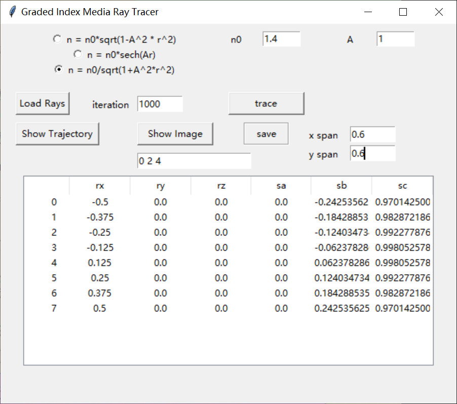
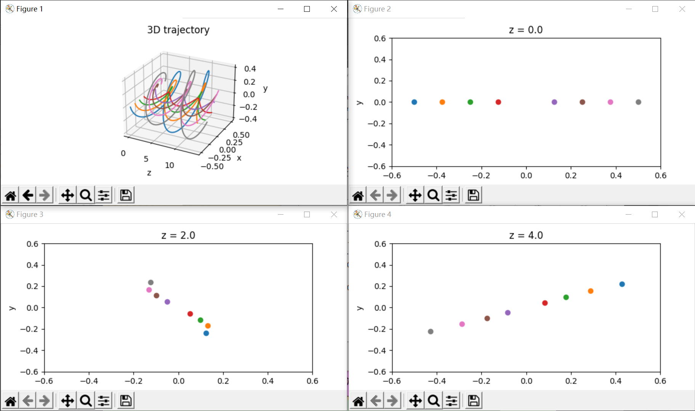

# Graded Index Media Ray Tracer

## Example

## Run

In command line, run “python main.py”

## Reference

1   Sharma, A., D. V. Kumar and A. K. Ghatak (1982). "Tracing rays through graded-index media: a new method." Applied Optics 21(6): 984-987.

2   Zhong, H., S. Zhang and F. Wyrowski (2014). Ray tracing in graded-index medium.

